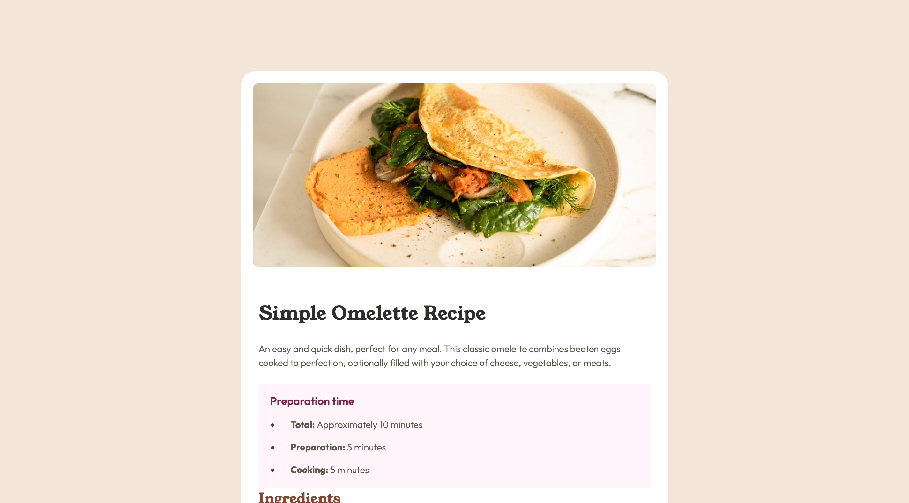

# Frontend Mentor - Recipe page solution

This is a solution to the [Recipe page challenge on Frontend Mentor](https://www.frontendmentor.io/challenges/recipe-page-KiTsR8QQKm).

## Table of contents

- [Overview](#overview)
  - [The challenge](#the-challenge)
  - [Screenshot](#screenshot)
  - [Links](#links)
- [My process](#my-process)
  - [Built with](#built-with)
  - [What I learned](#what-i-learned)
  - [Continued development](#continued-development)
  - [Useful resources](#useful-resources)
- [Author](#author)
- [Acknowledgments](#acknowledgments)

## Overview

### Screenshot

### Links

- Solution URL: [https://github.com/dirkvankrieken/Recipe-Page](https://github.com/dirkvankrieken/Recipe-Page)
- Live Site URL: [https://dirkvankrieken.github.io/Recipe-Page](https://dirkvankrieken.github.io/Recipe-Page)

## My process

### Built with

- Semantic HTML5 markup
- CSS custom properties
- Flexbox
- Mobile-first workflow

### What I learned

I learned better to work with tables in HTML and CSS.
I also learned to use media queries to make the website responsive to different screen sizes.

## Author

- Website - [dirkvankrieken.com](https://dirkvankrieken.com)
- Frontend Mentor - [@dirkvankrieken](https://www.frontendmentor.io/profile/dirkvankrieken)

